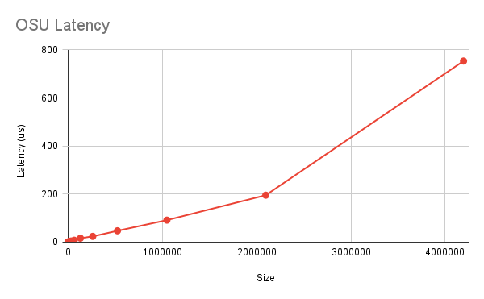
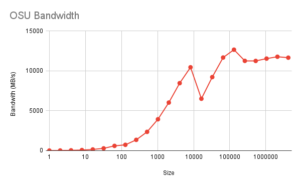
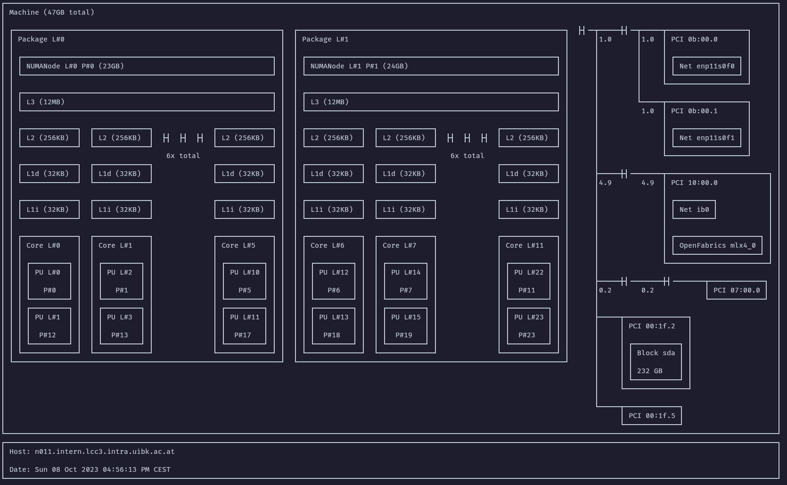
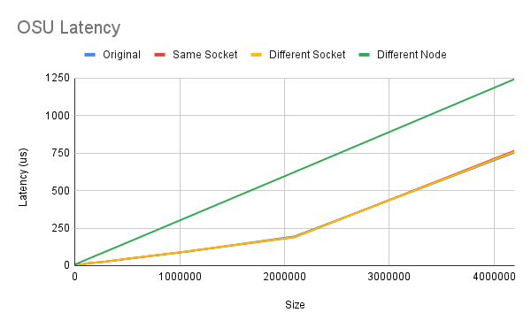
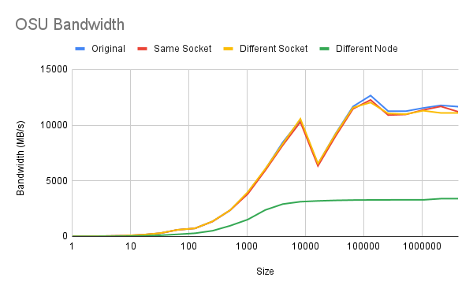
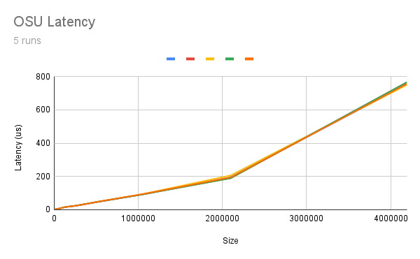
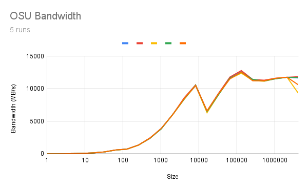

Team collaboration of Hendrik Munske and Florian Neururer

# Exercise 2

After running the different benchmarks using the script `job2.sh` the following data was observed:

#### osu_latency (Message Size in Bytes vs Latency in µs)

| Message Size | Latency (µs) |
| ------------ | ------------ |
| 0            | 0.16         |
| 1            | 0.16         |
| 2            | 0.17         |
| 4            | 0.16         |
| 8            | 0.16         |
| 16           | 0.17         |
| 32           | 0.21         |
| 64           | 0.22         |
| 128          | 0.32         |
| 256          | 0.34         |
| 512          | 0.37         |
| 1024         | 0.45         |
| 2048         | 0.59         |
| 4096         | 0.91         |
| 8192         | 1.57         |
| 16384        | 2.89         |
| 32768        | 4.69         |
| 65536        | 7.96         |
| 131072       | 16.37        |
| 262144       | 23.95        |
| 524288       | 47.21        |
| 1048576      | 91.62        |
| 2097152      | 195.33       |
| 4194304      | 753.64       |



### Observations

1. **Constant for small messages**: For message sizes from 0 to 16 bytes, the latency is almost constant (around 0.16-0.17 µs), which is an indicator of constant and low overhead for small messages.

2. **Linear Increase**: Afterwards there is a noticeable increase in latency. This suggests that for larger data sizes, the cost of data transfer starts to come into play. If we look at the figure this results in an almost linear increase depending on the message size.

3. **Significant Jumps**: There are large jumps in latency at 131072 bytes and especially at 2097152 and 4194304 bytes. This could indicate that the system has to manage additional complexity, possibly due to cache limits, memory paging, or network bottlenecks.

4. **High Latency at Largest Sizes**: The latency increases significantly for very large message sizes, possibly due to the need for the system to manage the high data volume.

#### osu_bw (Message Size in Bytes vs Bandwidth in MB/s)

| Message Size | Bandwidth (MB/s) |
| ------------ | ---------------- |
| 1            | 9.45             |
| 2            | 18.96            |
| 4            | 37.08            |
| 8            | 73.56            |
| 16           | 146.75           |
| 32           | 286.24           |
| 64           | 595.89           |
| 128          | 729.32           |
| 256          | 1352.51          |
| 512          | 2355.7           |
| 1024         | 3934.62          |
| 2048         | 6027.49          |
| 4096         | 8462.71          |
| 8192         | 10453.89         |
| 16384        | 6509.27          |
| 32768        | 9222.89          |
| 65536        | 11675.59         |
| 131072       | 12660.68         |
| 262144       | 11258.06         |
| 524288       | 11251.32         |
| 1048576      | 11542.8          |
| 2097152      | 11776.14         |
| 4194304      | 11659.32         |



### Observations

1. **Linear Increase for Small Messages**: The bandwidth increases linearly for small messages up to about 128 bytes, indicating efficient use of resources for small data.

2. **Peak Performance**: The bandwidth seems to peak around the 131072 bytes message size, suggesting that this might be the optimal chunk size for sending large data on this particular hardware.

3. **Drop After Peak**: There is a sharp decline in bandwidth for message sizes of 16384 bytes, which then picks back up but never fully recovers. This could be due to some system resource being maxed out or network contention.

4. **Stabilization**: Beyond 262144 bytes, the bandwidth stabilizes. This might indicate a system limit in the bandwidth that can be achieved for large message sizes.

5. **No Further Improvement**: Despite a further increase in the message size up to 4194304 bytes, there is no subsequent improvement in bandwidth, indicating that you're likely hitting a performance ceiling defined by the hardware or network architecture.

# Hardware Observations

By running `lstopo` with the job script provided in `job3.sh` we receive the following image:


### Machine Details

- The node has 47 GB of total memory.

### CPU and NUMA

- The machine contains two CPU packages (`Package L#0` and `Package L#1`), indicating a dual-socket configuration.
- Each CPU package is associated with a NUMA node (`NUMANode L#0` with 23 GB RAM and `NUMANode L#1` with 24 GB RAM).

### Cache

- Each CPU package has its own L3 cache of 12 MB.
- Each core within a CPU package has individual L2, L1d (L1 data), and L1i (L1 instruction) caches. Specifically, each core has 256 KB of L2 cache and 32 KB each of L1d and L1i caches.

### Cores and Threads

- Each CPU package contains 6 cores.
- Each core is capable of running 2 threads, indicated by the `PU` (Processing Unit) entries, which suggests that Hyper-Threading (or a similar technology) is enabled.

### Networking

- The machine has Ethernet (`enp11s0f0` and `enp11s0f1`) network interfaces.
- It also has an InfiniBand interface (`ib0`).

### Graphics and Storage

- The machine has a VGA compatible graphics card.
- It also has a disk drive labeled as `sda`.
- There are multiple PCI bridges, suggesting other hardware resources.

## Experiment Additions

### 1. Different Cores of the Same Socket

We can specify to SLURM that the MPI ranks for your job should be allocated to separate cores on the same socket by using the `--ntasks-per-socket` option to place the ranks.

```bash
#!/bin/bash
#SBATCH --job-name=test
#SBATCH --nodes=1
#SBATCH --ntasks=2
#SBATCH --ntasks-per-socket=2
#SBATCH --output=output.log

module load openmpi/3.1.6-gcc-12.2.0-d2gmn55

mpiexec ~/osu-micro-benchmarks-5.8/mpi/pt2pt/osu_latency
mpiexec ~/osu-micro-benchmarks-5.8/mpi/pt2pt/osu_bw
```

### 2. Different Sockets of the Same Node

We can specify that the MPI ranks should be placed on different sockets but within the same node. We can use `--ntasks-per-node` and `--sockets-per-node` to ensure this.

```bash
#!/bin/bash
#SBATCH --job-name=test
#SBATCH --nodes=1
#SBATCH --ntasks=2

#All nodes have 2 sockets so not necessary
#SBATCH --sockets-per-node=2

#SBATCH --ntasks-per-socket=1
#SBATCH --output=output.log

module load openmpi/3.1.6-gcc-12.2.0-d2gmn55

mpiexec ~/osu-micro-benchmarks-5.8/mpi/pt2pt/osu_latency
mpiexec ~/osu-micro-benchmarks-5.8/mpi/pt2pt/osu_bw
```

### 3. Different Nodes

For placing ranks on different nodes, we want to make use of SLURM's `--nodes` option, setting it to the number of nodes we need.

```bash
#!/bin/bash
#SBATCH --job-name=test
#SBATCH --nodes=2
#SBATCH --ntasks=2
#SBATCH --ntasks-per-node=1
#SBATCH --output=output.log

module load openmpi/3.1.6-gcc-12.2.0-d2gmn55

mpiexec ~/osu-micro-benchmarks-5.8/mpi/pt2pt/osu_latency
mpiexec ~/osu-micro-benchmarks-5.8/mpi/pt2pt/osu_bw
```

#### osu_latency (Message Size in Bytes vs Latency in µs)

| Message Size | Original | Same Socket | Different Socket | Different Node |
| ------------ | -------- | ----------- | ---------------- | -------------- |
| 0            | 0.16     | 0.16        | 0.17             | 1.69           |
| 1            | 0.16     | 0.16        | 0.16             | 1.65           |
| 2            | 0.17     | 0.16        | 0.17             | 1.65           |
| 4            | 0.16     | 0.16        | 0.17             | 1.64           |
| 8            | 0.16     | 0.16        | 0.16             | 1.64           |
| 16           | 0.17     | 0.17        | 0.16             | 1.64           |
| 32           | 0.21     | 0.21        | 0.21             | 1.65           |
| 64           | 0.22     | 0.22        | 0.21             | 1.81           |
| 128          | 0.32     | 0.31        | 0.31             | 2.53           |
| 256          | 0.34     | 0.34        | 0.33             | 2.67           |
| 512          | 0.37     | 0.37        | 0.37             | 2.95           |
| 1024         | 0.45     | 0.44        | 0.44             | 3.55           |
| 2048         | 0.59     | 0.59        | 0.59             | 4.63           |
| 4096         | 0.91     | 0.9         | 0.91             | 6.84           |
| 8192         | 1.57     | 1.56        | 1.57             | 8.87           |
| 16384        | 2.89     | 2.89        | 2.89             | 11.52          |
| 32768        | 4.69     | 4.71        | 4.68             | 16.62          |
| 65536        | 7.96     | 8.05        | 8.04             | 26.65          |
| 131072       | 16.37    | 16.17       | 16.3             | 46.22          |
| 262144       | 23.95    | 24.17       | 24.31            | 84.51          |
| 524288       | 47.21    | 48.24       | 48.05            | 161.09         |
| 1048576      | 91.62    | 92.54       | 93.07            | 315.5          |
| 2097152      | 195.33   | 189.59      | 191.27           | 624.26         |
| 4194304      | 753.64   | 766.11      | 759.46           | 1242.87        |



#### osu_bw (Message Size in Bytes vs Bandwidth in MB/s)

| Message Size | Original | Same Socket | Different Socket | Different Node |
| ------------ | -------- | ----------- | ---------------- | -------------- |
| 1            | 9.45     | 9.31        | 9.45             | 3.06           |
| 2            | 18.96    | 18.86       | 18.49            | 6.49           |
| 4            | 37.08    | 37.7        | 38.11            | 12.95          |
| 8            | 73.56    | 72.17       | 75.43            | 25.46          |
| 16           | 146.75   | 151.27      | 150.54           | 51.94          |
| 32           | 286.24   | 288.64      | 297.51           | 104.08         |
| 64           | 595.89   | 593.44      | 598.75           | 190.7          |
| 128          | 729.32   | 734.21      | 730.35           | 289.68         |
| 256          | 1352.51  | 1346.37     | 1362.35          | 514.27         |
| 512          | 2355.7   | 2360.2      | 2365.27          | 963.9          |
| 1024         | 3934.62  | 3814.74     | 3981.54          | 1518.23        |
| 2048         | 6027.49  | 5931.82     | 6067.95          | 2379.38        |
| 4096         | 8462.71  | 8204.88     | 8338.56          | 2911.78        |
| 8192         | 10453.89 | 10283.53    | 10569.71         | 3121.97        |
| 16384        | 6509.27  | 6336.26     | 6541.84          | 3194.2         |
| 32768        | 9222.89  | 8997.24     | 9190.59          | 3242.87        |
| 65536        | 11675.59 | 11464.58    | 11573.87         | 3270.49        |
| 131072       | 12660.68 | 12265.25    | 12033.79         | 3282.37        |
| 262144       | 11258.06 | 10903.4     | 11049.77         | 3287.81        |
| 524288       | 11251.32 | 10960.32    | 10984.71         | 3292.22        |
| 1048576      | 11542.8  | 11362.58    | 11298.18         | 3288.82        |
| 2097152      | 11776.14 | 11683.48    | 11097.19         | 3395.64        |
| 4194304      | 11659.32 | 11198.48    | 11098.29         | 3396.35        |



### Observations

In general, we can observe that the original and Same Socket configuration are basically equal, indicating that in the original configuration is equivalent to the same socket version.

1. **Same Socket**: This represents the best latency and bandwidth as ranks in the same socket can share cache, leading to faster data exchange.
2. **Different Socket, Same Node**: There is possibly a very slight increase in latency and decrease in bandwidth noticeable due to data having to travel through the socket interconnect. This is very minimal and barely noticeable.
3. **Different Nodes**: This results in higher latency and lower bandwidth as the data now has to travel over the network which is visible in the lower performance.

### Verifying Rank Placement

There are multiple ways to verify rank placement without performance indicators:

1. **MPI flag**: In MPI you can set the `--display-map` flag to display the mapping of MPI processes to hosts. This will output a map that shows which MPI ranks are running on which hosts. It's an easy way to verify that ranks are placed where you intend them to.
2. **SLURM Output**: You can include `srun hostname` or a similar command in your SLURM script to output the hostnames where tasks are running.

## Measurement Stability

It seems that the measurements are very stable when running the original experiments multiple times. The values are quite consistent across different runs, indicating a well-controlled test environment and reliable benchmarking tools.
The only thing that is noticeable that when looking at bandwidth at very large message sizes a larger distribution can be seen.
To further illustrate this point, in the following two graphs the measurements are shown across multiple runs.



