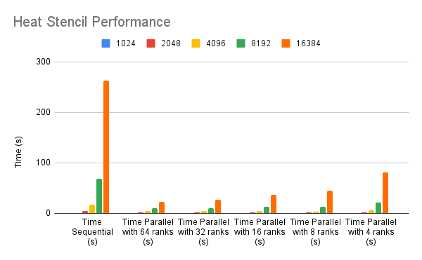

Team collaboration of Hendrik Munske and Florian Neururer

## Parallelization Strategy

### Communication Pattern

- Point-to-Point: In this task we used a Point-to-Point communication pattern where each rank communicates with its left and right neighbor (if they exist). Upon each time step the outer left and right value of each rank are sent to the relevant neighbor. This does not include the first and last element of the buffer since these are used to store the values of the neighbors (called ghost cells).

We chose this pattern because this would provide less communication because only adjacent ranks need to exchange data, reducing the overall amount of communication. And only the relevant elements are sent which keeps the individual messages small.

### Additional Changes

- **Data Partitioning**: In the provided code, the 1D grid is partitioned among the available ranks, so each process is responsible for a subset of the grid. This ensures that each rank has correct boundary values at the start.

- **Synchronization**: The code uses non-blocking communication with `MPI_Irecv` and `MPI_Isend` followed by `MPI_Wait` to ensure synchronization of the boundary values. It's essential to ensure that the received data is used only after it has been successfully received.

- **Boundary Checks**: Additional logic is required to handle ranks at the edge (i.e., ranks 0 and `numProcs - 1`) as they have only one neighbor to communicate with.

### Performance

| N     | Time Sequential (s) | Time Parallel with 64 ranks (s) | Time Parallel with 32 ranks (s) | Time Parallel with 16 ranks (s) | Time Parallel with 8 ranks (s) | Time Parallel with 4 ranks (s) |
| ----- | ------------------- | ------------------------------- | ------------------------------- | ------------------------------- | ------------------------------ | ------------------------------ |
| 1024  | 1.065               | 1.200                           | 1.179                           | 1.149                           | 0.558                          | 0.611                          |
| 2048  | 4.257               | 2.377                           | 2.347                           | 2.380                           | 1.372                          | 1.866                          |
| 4096  | 17.140              | 4.707                           | 4.919                           | 5.243                           | 4.073                          | 5.948                          |
| 8192  | 68.196              | 10.054                          | 10.526                          | 13.172                          | 12.725                         | 21.631                         |
| 16384 | 263.281             | 22.787                          | 26.719                          | 36.657                          | 45.687                         | 81.310                         |

### Observations

### Speedup and Efficiency

- **Smaller Problem Sizes**: For small values of \(N\), the parallel versions do not outperform the sequential version. This suggests that for smaller problems, the communication overhead outweighs the computational gains. For \(N = 1024\), we even see a slowdown.

- **Larger Problem Sizes**: For larger \(N\), parallelization yields substantial benefits. Speedup can be particularly noticed when going from \(N = 1024\) to \(N = 16384\) since the relative overhead gets smaller.

- **Non-Linear Speedup**: As with Task 1 the speedup isn't linear with respect to the number of ranks. For example, 64 ranks don't give a speedup that is 64 times better than a single rank.

- **Optimal Rank Count**: It seems there's an optimal number of ranks for each problem size, beyond which performance starts to degrade. For instance, for \(N = 4096\), 8 ranks give the best performance.

### Scalability

- **Weak Scalability**: The system doesn't scale well when we fix the problem size and increase the number of ranks. This could be due to a rise in communication overhead since we cut the problem into smaller chunks a therefore have to communicate more.

- **Problem Size Scalability**: The system shows better scalability where we increase the problem size.

- **Overheads**: For smaller \(N\), the communication overhead becomes noticeable, and so adding more ranks doesn't linearly decrease the time, thus indicating that resources might not be optimally utilized.
