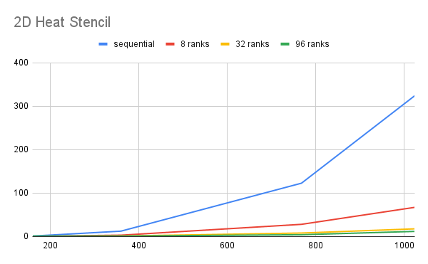
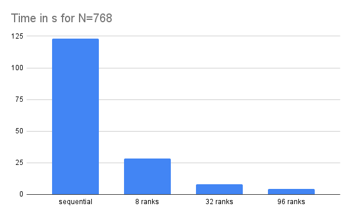
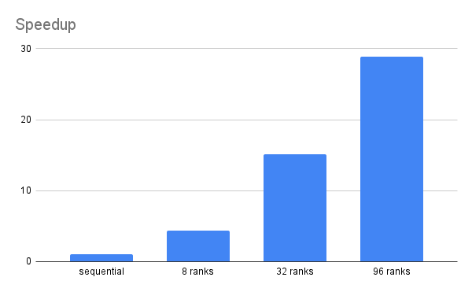
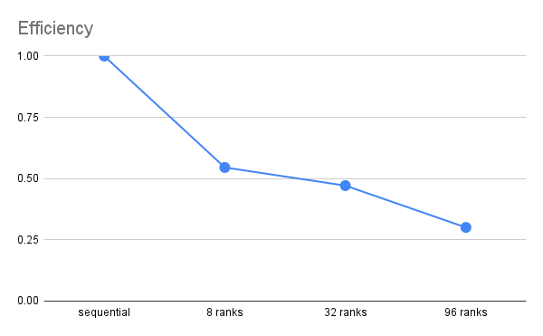

Team collaboration of Hendrik Munske and Florian Neururer

### Performance Measurement

| N    | sequential | 8 ranks | 32 ranks | 96 ranks |
| ---- | ---------- | ------- | -------- | -------- |
| 160  | 1.11       | 0.527   | 0.382    | 1.108    |
| 360  | 12.476     | 3.179   | 1.267    | 1.104    |
| 768  | 122.895    | 28.166  | 8.149    | 4.259    |
| 1024 | 324.321    | 67.289  | 17.79    | 11.893   |

### Weak Scalability

For weak scalability, we would ideally like to see the computation time remain approximately constant when both the problem size and the number of processors are increased proportionally. To observe weak scalability, one can select a subset of data where the problem size and number of ranks are increasing in a proportional manner.

However, it should be noted that our data set doesn't exactly fit into this category as the problem sizes and number of ranks aren't increasing strictly proportionally.

Still, we can make some qualitative observations:

- When \( N = 160 \) with 8 ranks, time taken is 0.527.
- When \( N = 360 \) with 32 ranks, time taken is 1.267.
- When \( N = 768 \) with 96 ranks, time taken is 4.259.

While not proportional, these could be viewed as representing some weak scalability characteristics, though they don't form a perfect linear relationship. Ideally, for perfect weak scalability, if the problem size and the number of ranks were increased proportionally, the time should remain approximately constant.

### Justification for Choice

Both strong and weak scalability metrics provide valuable insights:

1. **Strong Scalability**: This is useful for understanding how well the application performs for a fixed problem size when adding more processors.

2. **Weak Scalability**: This is important for understanding how well the application can handle larger problem sizes when more resources are added.

### Domain-Specific Metric: Iterations per Second

In a 2D heat stencil simulation, one important metric is the number of grid iterations completed per second. This gives an idea of how quickly the simulation is advancing through time, which is crucial when you're running long simulations.

#### Interations per second N=768

| sequential  | 8 ranks     | 32 ranks   | 96 ranks    |
| ----------- | ----------- | ---------- | ----------- |
| 624.9237154 | 2726.691756 | 9424.46926 | 18032.40197 |

### Domain-Insensitive Metric: Wall-Clock Time

Wall-clock time refers to the actual time it takes for the program to complete its execution, from start to finish. This measure takes into account not just the computational work, but also any time spent in I/O, waiting for resources, or any other types of delays. It provides an overall sense of the runtime efficiency of the program.

This Metric is measure and illustrated in the tables above.

## Correctness

1. **Comparison to the Sequential Version:** One of the most straightforward ways to confirm that the parallelized version of the application is correct is by comparing its output with that of the sequential version. If both versions produce the same output for the same input, it strongly suggests that the parallel version is correct.

2. **Absence of Changing Results Upon Multiple Executions:** Running the parallel application multiple times with the same input should yield consistent results.
