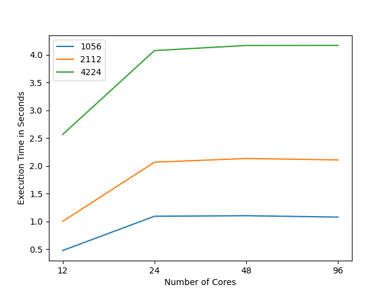
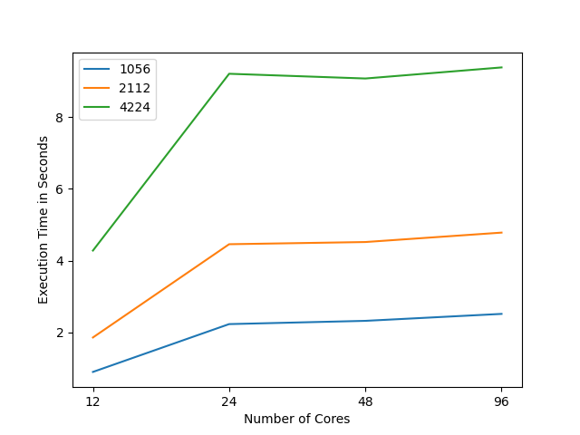
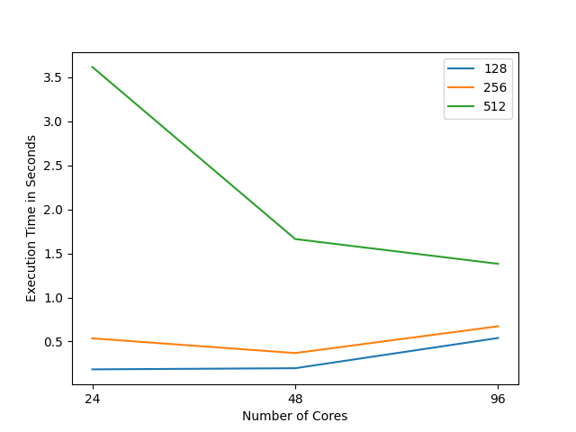
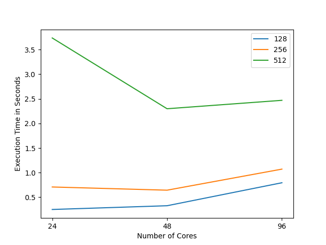

Team collaboration of Hendrik Munske and Florian Neururer

## Performance Measurement

### Heat Stencil 1D

#### Non-blocking

| N    | 12 ranks | 24 ranks | 48 ranks | 96 ranks |
| ---- | -------- | -------- | -------- | -------- |
| 1056 | 0.478    | 1.094    | 1.104    | 1.079    |
| 2112 | 1.002    | 2.066    | 2.133    | 2.107    |
| 4224 | 2.564    | 4.073    | 4.165    | 4.166    |

#### Blocking

| N    | 12 ranks | 24 ranks | 48 ranks | 96 ranks |
| ---- | -------- | -------- | -------- | -------- |
| 1056 | 0.891    | 2.226    | 2.317    | 2.511    |
| 2112 | 1.853    | 4.456    | 4.517    | 4.780    |
| 4224 | 4.279    | 9.214    | 9.082    | 9.391    |

### Heat Stencil 2D

#### Non-blocking

| N   | 24 ranks | 48 ranks | 96 ranks |
| --- | -------- | -------- | -------- |
| 128 | 0.184    | 0.197    | 0.540    |
| 256 | 0.536    | 0.369    | 0.673    |
| 512 | 3.616    | 1.663    | 1.382    |

#### Blocking

| N   | 24 ranks | 48 ranks | 96 ranks |
| --- | -------- | -------- | -------- |
| 128 | 0.252    | 0.328    | 0.795    |
| 256 | 0.709    | 0.644    | 1.072    |
| 512 | 3.737    | 2.299    | 2.470    |

